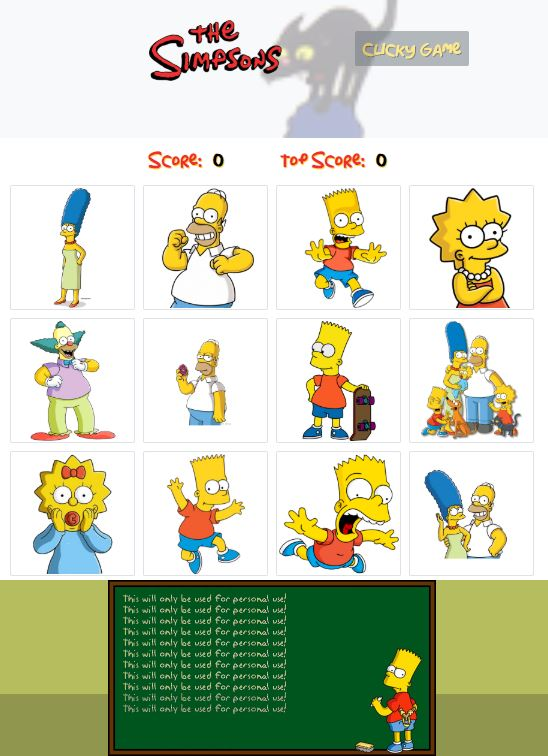

# clicky-game
Game built with React and deployed with front end only. The Clicky Game Simpson's Edition is designed to test your memory. See if you can click all 12 unique cards and get the Top Score.

## Deployed Application:
https://sthmpsn.github.io/clicky-game/

## Instructions
* Click a unique card each time and you'll score 1 point
* Click a card you already clicked before and your game is over and a new round starts
  * Note: Cards will shake to indicate that you already selected that card and the game is over

## Technologies
* Bootstrap framework (React-Bootstrap)
* React.js
* React-Router

 
## Screenshots

## Contributors
* Steve Thompson (sthmpsn)
